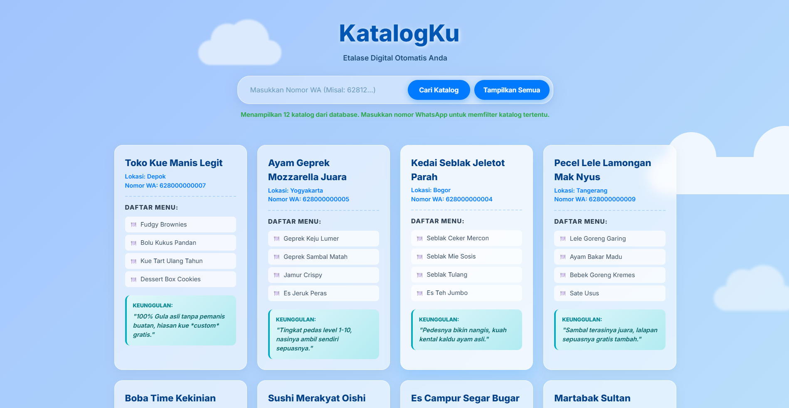
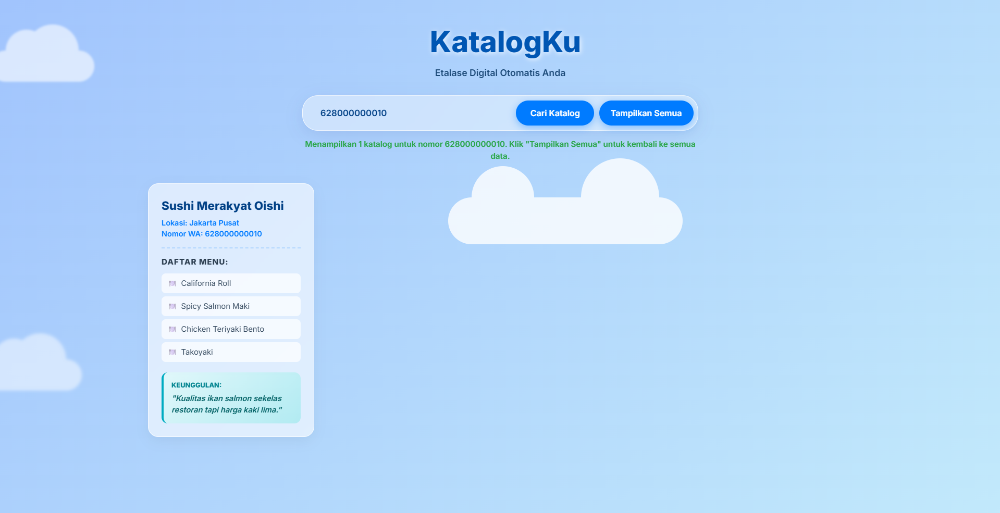
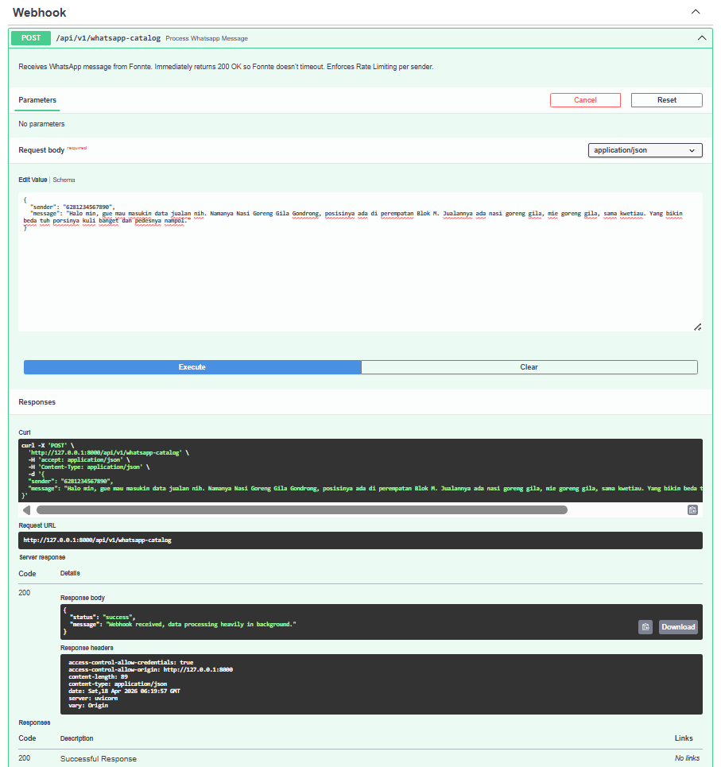

# WhatsApp Catalog AI

A FastAPI-based middleware that receives unstructured WhatsApp messages, extracts structured business catalog data using an LLM, stores the results in SQLite, and serves them through a REST API and a responsive frontend.


## Overview

This project is intended for workflows where:

- incoming WhatsApp messages are unstructured
- an AI model is needed to extract catalog information
- the extracted data should be stored in a lightweight local database
- the catalog must be accessible through a simple web interface

## Features

- AI-powered extraction for `product_name`, `location`, `menus`, and `unique_selling_point`
- WhatsApp webhook endpoint with background processing
- per-sender rate limiting
- SQLite persistence via SQLAlchemy
- automatic database seeding on container startup
- seed logic with upsert behavior per `user_id`
- responsive frontend for mobile, tablet, and desktop
- frontend default view that shows all catalogs before filtering by WhatsApp number
- Windows helper scripts for Docker-based testing and database reset

## Tech Stack

| Layer | Technology |
|---|---|
| Backend | FastAPI, Uvicorn |
| AI / LLM | LangChain, Groq |
| Database | SQLite, SQLAlchemy |
| Configuration | Pydantic Settings |
| Frontend | HTML, CSS, JavaScript |
| Testing | Pytest, HTTPX |
| Deployment | Docker, Docker Compose |

## Application Flow

```text
WhatsApp Message
      |
      v
POST /api/v1/whatsapp-catalog
      |
      v
Background task calls the AI extractor
      |
      v
Extracted result is upserted into SQLite
      |
      +--> GET /api/v1/catalogs/                -> display all catalogs
      |
      `--> GET /api/v1/catalogs/users/{user_id}/catalogs
                                               -> filter catalogs by WhatsApp number
```

## Screenshots
```md



```

## Project Structure

```text
wa-catalog-backend/
|- app/
|  |- api/
|  |  |- catalog.py
|  |  `- webhook.py
|  |- core/
|  |  |- config.py
|  |  |- database.py
|  |  `- logger.py
|  |- models/
|  |  |- pydantic_schemas.py
|  |  `- schema.py
|  `- services/
|     `- ai_extractor.py
|- tests/
|  `- test_api.py
|- wa-catalog-frontend/
|  |- app.js
|  |- index.html
|  `- styles.css
|- data/
|- docs/
|  `- screenshots/
|     `- README.md
|- docker-compose.yml
|- docker-entrypoint.sh
|- Dockerfile
|- main.py
|- reset-db.bat
|- seed.py
`- test.bat
```

## Environment

Create a `.env` file in the project root:

```env
GROQ_API_KEY=your_groq_api_key
LANGCHAIN_TRACING_V2=true
LANGCHAIN_ENDPOINT="https://api.smith.langchain.com"
LANGCHAIN_API_KEY=
LANGCHAIN_PROJECT="Wa bot katalog"
DATABASE_URL=sqlite:////app/data/catalog_db.sqlite
```

Notes:

- the `DATABASE_URL` above is intended for Docker usage
- do not commit `.env` to GitHub
- if any API key has been exposed, rotate it immediately

## Running With Docker

The current project workflow is Docker-first.

Start the application with:

```bash
docker compose up --build
```

Services will be available at:

- API: `http://127.0.0.1:8000`
- Swagger UI: `http://127.0.0.1:8000/docs`

When the container starts, the application will:

1. create `/app/data` if it does not exist
2. create database tables if they do not exist
3. run `seed.py`
4. start FastAPI with Uvicorn

## Seed Behavior

The current [seed.py](./seed.py) no longer skips execution simply because the database already contains data.

Current behavior:

- if a `user_id` does not exist, a new row is inserted
- if a `user_id` already exists, the row is updated
- if `FORCE_RESEED=true`, the `catalogs` table is cleared before reseeding

This means new entries added to the seed list can be loaded without deleting the entire database first.

To run the seed manually inside the container:

```bash
docker compose exec -T wa-catalog-backend python seed.py
```

## Resetting the Database

To remove the current database and load a fresh one from `seed.py`, use:

```bat
reset-db.bat
```

This script will:

1. stop the running containers
2. delete `data\catalog_db.sqlite`
3. rebuild and restart the containers
4. print the latest startup and seed logs

## Testing

To run the Docker-based end-to-end test flow:

```bat
test.bat
```

This script will:

1. build and start the containers
2. wait until the API is ready
3. run `pytest` inside the container
4. execute a webhook smoke test

## Frontend

The frontend is located in [wa-catalog-frontend](./wa-catalog-frontend).

Current behavior:

- when the page loads, all catalogs are displayed by default
- the WhatsApp number input is used to filter catalogs by user
- the `Show All` button restores the full catalog list
- the layout has been optimized for mobile, tablet, and desktop screens

Once the backend is running, open:

- `wa-catalog-frontend/index.html`

Make sure `app.js` points to the correct backend API:

- `http://127.0.0.1:8000/api/v1/catalogs`

## API Endpoints

| Method | Endpoint | Description |
|---|---|---|
| `GET` | `/` | Health check |
| `POST` | `/api/v1/whatsapp-catalog` | Receives incoming WhatsApp webhook payloads |
| `GET` | `/api/v1/catalogs/` | Returns all catalogs |
| `GET` | `/api/v1/catalogs/users/{user_id}/catalogs` | Returns catalogs filtered by WhatsApp number |

## Local Development Without Docker

Docker is the recommended way to run this project. If you want to run it locally, you need to:

1. change `DATABASE_URL` to a local path such as `sqlite:///./catalog_db.sqlite`
2. install dependencies:

```bash
pip install -r requirements.txt
```

3. start the server:

```bash
uvicorn main:app --reload --port 8000
```

4. run the seed:

```bash
python seed.py
```

## Important Notes

- the Docker SQLite database is stored in the `data/` directory
- changes in `seed.py` do not automatically remove old data unless you reset the database or enable `FORCE_RESEED=true`
- `.env` contains secrets and must not be published

## Troubleshooting

### 1. New data added to `seed.py` does not appear in the frontend

Common causes:

- the old database in `data/` is still being used
- the seed has not been run again
- the container has not been rebuilt after the change

Solutions:

```bat
reset-db.bat
```

Or run the seed manually:

```bash
docker compose exec -T wa-catalog-backend python seed.py
```

### 2. The frontend cannot fetch data

Check the following:

- the backend is running at `http://127.0.0.1:8000`
- `wa-catalog-frontend/app.js` points to the correct port
- the container did not fail during startup

To inspect logs:

```bash
docker compose logs --tail=200
```

### 3. `python seed.py` fails when run locally

Typical causes:

- local Python dependencies are not installed
- `DATABASE_URL` is still pointing to the Docker path `/app/data/...`

Local fix:

```bash
pip install -r requirements.txt
```

Then change `DATABASE_URL` to a local path, for example:

```env
DATABASE_URL=sqlite:///./catalog_db.sqlite
```

### 4. The container starts, but old data still appears

This is expected if `data/catalog_db.sqlite` still exists. The Docker bind mount preserves the existing database file.

Use:

```bat
reset-db.bat
```

### 5. Docker tests fail in `test.bat`

Check the following:

- Docker Desktop is running
- port `8000` is not already occupied
- `.env` exists in the project root

For detailed logs:

```bash
docker compose logs --tail=200
```

## License

MIT
